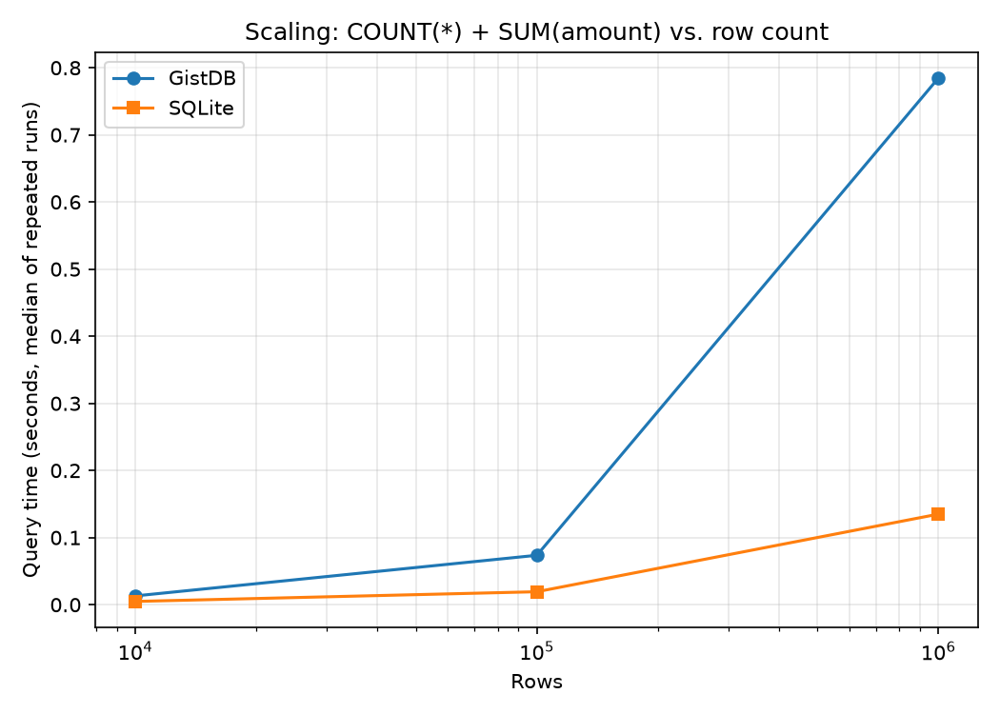
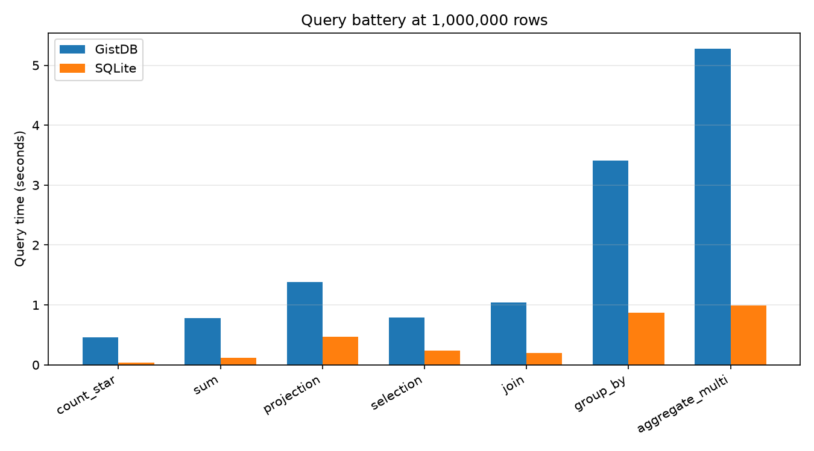
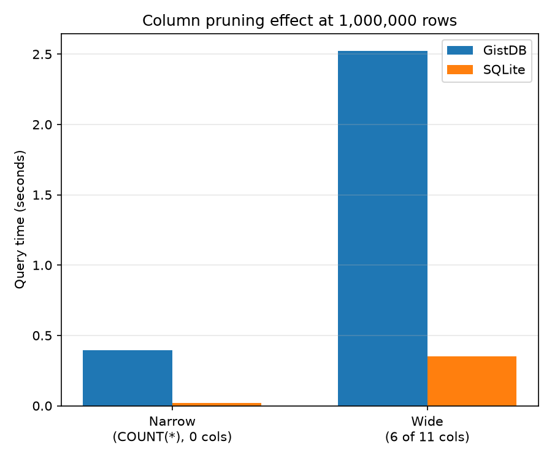
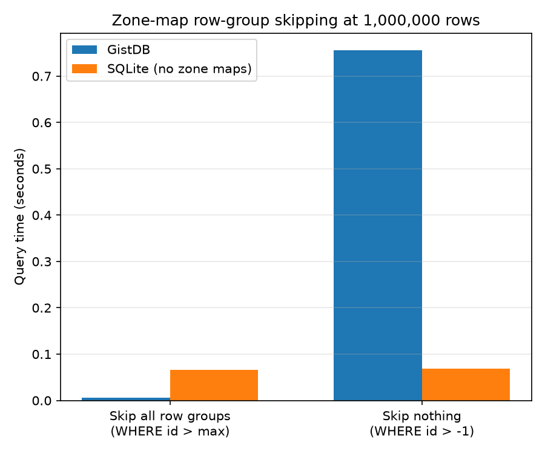
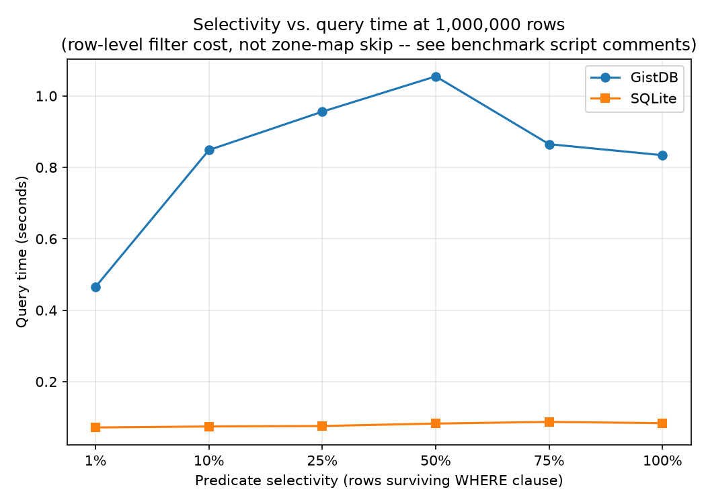
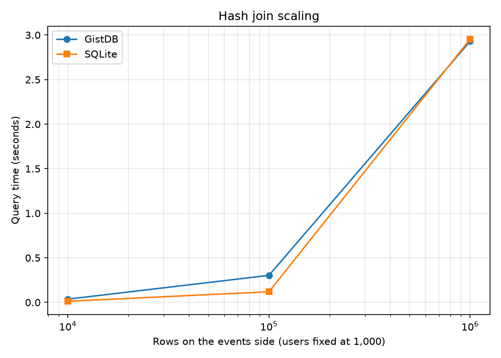
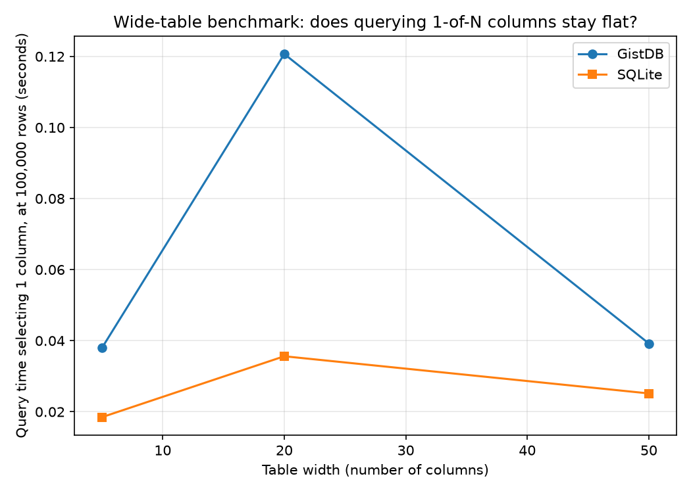
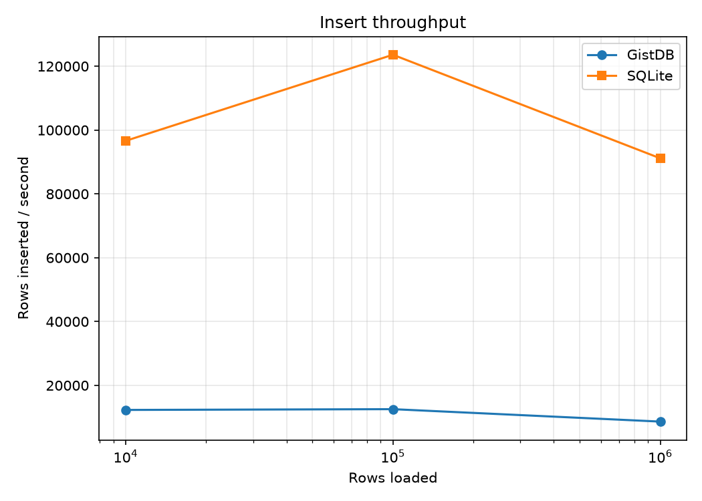
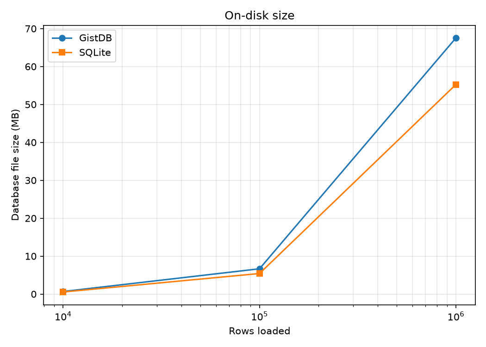
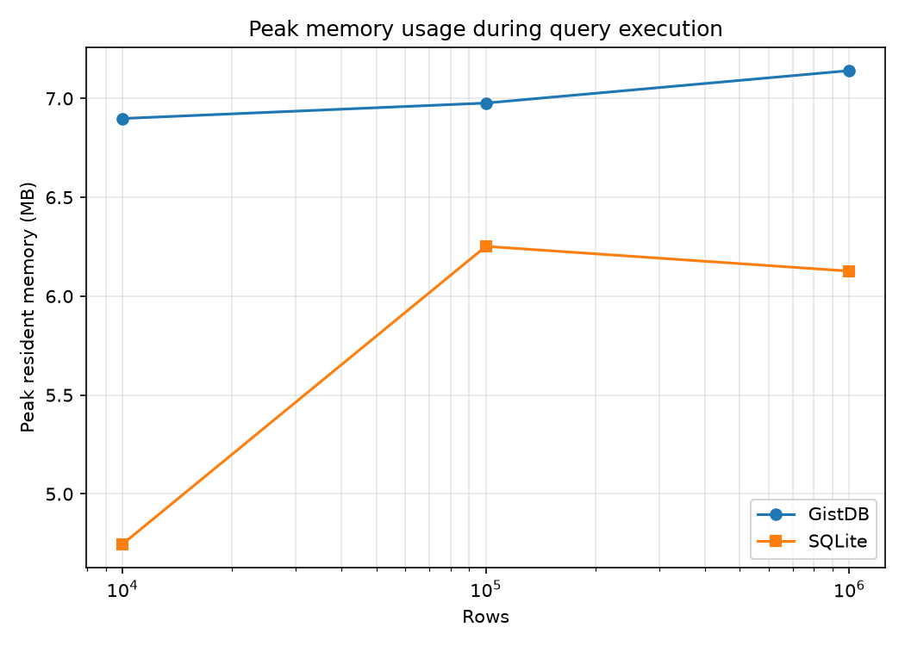

# GistDB Benchmark Report

All benchmarks use the median of N repeated runs. The first run is discarded as a warm-up. Timings are measured externally using Python's `time.perf_counter()` around each process execution, rather than relying on query times reported by either engine. The benchmark scripts are available in `benchmarks/`.

## Scaling

## Query Workloads

## Column Pruning

## Zone-Map Row-Group Skipping

## Predicate Selectivity

Measures the cost of filtering rows at different selectivity levels. This benchmark focuses on row-level filtering and does not measure zone-map skipping, since the test data is not clustered by the filtered column.

## Join Scaling

## Wide-Table Benchmark

## Insert Throughput & Storage Size

## Memory Usage

